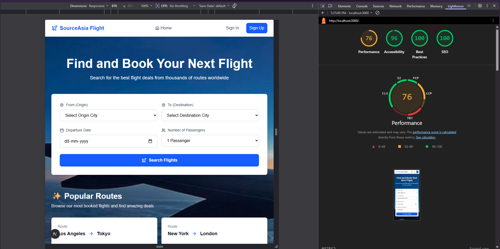

# Flight Booking PWA

A responsive flight booking Progressive Web App (PWA) with realtime seat selection, bookings management, rescheduling and cancellation. Built with Next.js (App Router), Supabase (Postgres + Realtime), Zustand state, Tailwind CSS and Framer Motion for UI animations.

## Features

- Flight search and results
- Interactive seat map with realtime availability
- Multi-passenger booking flow
- Booking confirmation with PNR
- My Bookings: cancel & reschedule (DB-enforced rules)
- RPC functions for atomic seat locking and reschedule
- Supabase RLS policies (user-scoped access)
- PWA support (manifest, service worker via `next-pwa`, offline page)
- Accessibility improvements (90+ Lighthouse score)

## Requirements

- Node.js 18+ (recommended)
- npm or yarn
- Supabase project (database + Auth)

## Environment Variables

>Create a `.env.local` in the project root (DO NOT commit). Example keys used by the app:

```env
NEXT_PUBLIC_SUPABASE_URL=<your-supabase-url>
NEXT_PUBLIC_SUPABASE_ANON_KEY=<your-anon-key>
SUPABASE_SERVICE_ROLE_KEY=<your-service-role-key>  # used only server-side
NEXTAUTH_URL=http://localhost:3000
```

If you want, I can generate a `.env.example` file with these variable names.

## Local Setup

Install dependencies:

```bash
npm install
```

Run development server:

```bash
npm run dev
```

Build for production:

```bash
npm run build
npm run start
```

## Database & Seeding

Migrations and seed scripts are in `supabase/migrations` and `supabase/seed.sql`.

To seed sample flights and seats (run on your supabase DB):

1. Open Supabase dashboard → SQL Editor
2. Run the SQL in `supabase/seed.sql`

Notes:
- Seats are created per-flight with `is_available = TRUE` by default.
- RPC functions are in `supabase/migrations/003_rpc_functions.sql`.

## PWA

- `next-pwa` is configured in `next.config.ts` and served from `/public`.
- Manifest is at `/public/manifest.json` and icons are in `/public`.
- An offline page is provided at `/offline`.

To test PWA behavior:
- Build and run `npm run build && npm run start`
- Open in Chrome and run Lighthouse PWA audit

## Deployment (Vercel)

- Link your GitHub repo to Vercel
- Add environment variables in Project Settings (same keys as `.env.local`)
- Production build will run `npm run build`

## Testing & Validation

- Manual E2E flows: Search → Book → Confirm → My Bookings → Reschedule/Cancel
- Run Lighthouse PWA & Accessibility audits in Chrome DevTools (Target: 90+ accessibility)

## Developer Notes

- Supabase server client is in `lib/supabase/server.ts` and uses service role keys for RPCs requiring elevated access.
- Realtime: seat updates use Supabase Realtime channels and are cleaned up on unmount.
- State: Zustand store is in `lib/stores` with persist (sensitive fields are excluded).

## Next Steps (suggested)

- Add `.env.example` (I can create it)
- Add automated E2E tests (Playwright or Cypress)
- Add Lighthouse CI for automated audits

---

If you want, I can now:
- Create `.env.example` with variable names,
- Run a Lighthouse audit and attach the PWA screenshot,
- Or push any remaining commits / create a release.

Which should I do next?

## Lighthouse Screenshot

Below is the latest Lighthouse audit screenshot captured for the app (local dev). If the image does not appear, save the screenshot as `lighthouse.png` in the `public/screenshots/` folder.



> Note: Replace `public/screenshots/lighthouse.png` with your actual screenshot filename if different.
